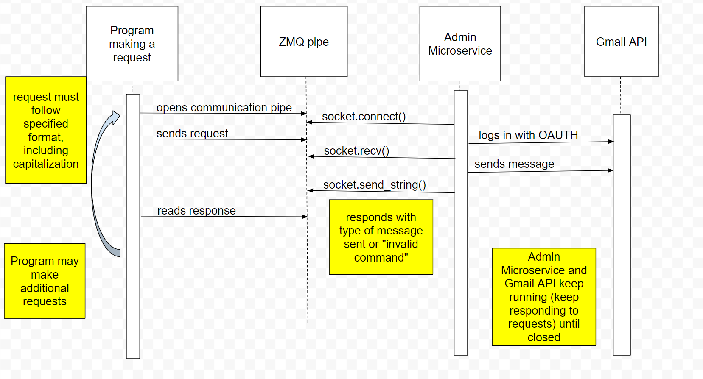

These scripts require two packages: ZMQ and the Google API Python Client
I was able to install these packages from the Python command line using:
    py -m pip install --upgrade google-api-python-client google-auth-httplib2 google-auth-oauthlib
    py -m pip install pyzmq

As of 2024-02-29, the admin notification microservice requires the user to validate their OAUTH connection to the
communications account (361foodapp@gmail.com) every time it is run, but it will remain running until stopped,
and it can process multiple requests.

##
Data Requests
##

Data requests come in two formats: admin notifications and user notifications.

Admin notifications must be sent as a string in the following format:
    TYPE: admin; CONTACT: {contactEmail}; RECIPE NAME: {recipeName}; RECIPE: {recipe}; USER: {user}

    This will notify the admin, whose email is listed as {contactEmail}, that the {user} has submitted the recipe
    {recipeName} and entered the instructions as {instructions}

User notifications must be sent as a string in the following format:
    TYPE: user; CONTACT: {contactEmail}; RECIPE NAME: {recipeName}

    This will notify the user, whose email is listed as {contactEmail}, that they submitted {recipeName}

##
Data Received
##
The microservice will return a confirmation message for the status of the request.

##
UML Diagram
##
Google drawing format is here: https://docs.google.com/drawings/d/1A8X5zmcft6YuYtQQ9EUwz0MH29Al_3OD9WA3-5Jx59Y/edit?usp=sharing

